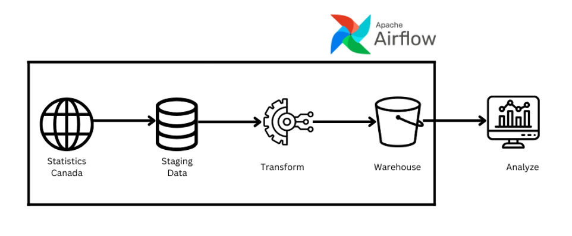

# ETL Pipeline Using Airflow




This repository contains an ETL (Extract, Transform, Load) pipeline that extracts average hourly earnings data from Statistics Canada, transforms it in Databricks, and saves the results to an AWS S3 bucket. The entire pipeline is orchestrated using Apache Airflow.

## Project Overview

1. **Extraction**: 
   - The project extracts data on **average hourly earnings for employees paid by the hour**, categorized by industry and year.
   - The extraction is done using the `stats_can` library, which is responsible for fetching the data from the Statistics Canada website. Note that filtering and querying capabilities are not provided by this library; instead, they are handled during the transformation phase.

2. **Transformation**: 
   - The extracted data undergoes several transformation steps in Databricks, which include:
     - **Data Cleaning**: Removing irrelevant columns and filtering out poor-quality data to ensure a clean dataset for analysis.
   - Databricks is configured with the following specifications:
     - **Cluster Type and Access**: A multi-node cluster with single-user access (Maharshi Patel) for dedicated processing tasks.
     - **Runtime and Acceleration**: Utilizing Databricks Runtime 15.4 LTS with Apache Spark 3.5.0. Photon Acceleration (if enabled) optimizes SQL workloads for faster processing.
     - **Node Specs and Autoscaling**: Worker and driver nodes are r6id.xlarge (32 GB, 4 cores) with autoscaling capabilities, adjusting between 2 to 8 workers based on workload demands.
     - **Monitoring Tools**: The pipeline employs Spark UI, event, and driver logs for real-time monitoring, performance optimization, and debugging.

3. **Load**: 
   - After transformation, the cleaned data is stored in an AWS S3 bucket in **Parquet format**, which is suitable for efficient data storage and processing. The data is organized in a single folder, with Databricks automatically partitioning it, making it efficient for handling large datasets.

4. **Analysis**: 
   - An analysis notebook (`analyzing_wage_airflow.ipynb`) is provided, which generates insights from the cleaned data stored in S3. Key insights include:
     - Lowest wage industry in each province for the year 2023
     - Highest wage industry in each province for the year 2023
     - Maximum wage trend by year and geographical location (GEO)
     - Maximum wage per year categorized by GEO
     - Minimum wage per year categorized by GEO

## Directory Structure

- **dags/**: Contains the main Airflow DAG script (`extract_transform_load_dag.py`) that orchestrates the workflow.
- **transform&load_wage.ipynb**: Contains the transformation logic implemented using Databricks.
- **analyzing_wage_airflow.ipynb**: Jupyter notebook that analyzes the cleaned data stored in S3.
- **README.md**: Provides project description, setup, and usage instructions.

## Setup Instructions

1. **Clone the repository**
   ```bash
   git clone https://github.com/MaharC2307/Canada_Wage_ETL_Airflow.git
   cd Canada_Wage_ETL_Airflow
